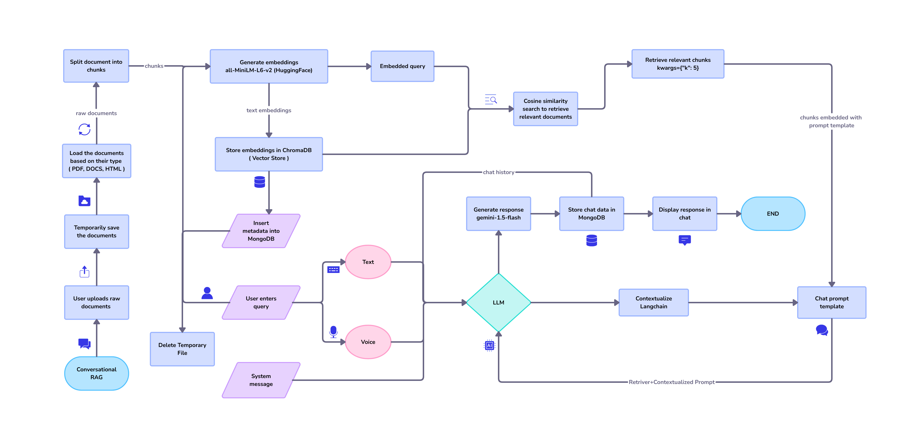

### Langchain RAG Chatbot

### Project Description
The Langchain RAG Chatbot is an advanced AI-powered conversational tool designed to provide context-aware responses by leveraging Retrieval-Augmented Generation (RAG). This project combines document retrieval with language model generation, enabling users to upload documents in various formats (PDF, DOCX, HTML), index their contents, and interact with a chatbot to retrieve and discuss information from those documents. Built with a modern tech stack and a sleek Streamlit interface, this application is ideal for users who need an efficient way to query and explore document-based knowledge.
### Tech Stack
The project utilizes a robust set of technologies, each serving a specific purpose:

### Frontend:

Streamlit: A Python library for creating an interactive web-based user interface. It powers the chat window, sidebar, and document management features.


### Backend:

FastAPI: A high-performance web framework for building APIs with Python. It handles requests for document processing, chat interactions, and database operations.


### Database:

MongoDB: A NoSQL database used to store chat logs (conversation history) and metadata about uploaded documents, such as file names and indexing status.


### Vector Store:

ChromaDB: A lightweight, embedded vector database for storing and retrieving document embeddings, enabling fast similarity searches for RAG.


### Language Model:

Google Generative AI (Gemini-1.5-Flash): A powerful generative AI model used to produce human-like responses based on retrieved document chunks.


### Embedding Model:

HuggingFace all-MiniLM-L6-v2: A sentence transformer model for generating embeddings from document text, ensuring efficient retrieval of relevant content.


### Document Loaders (from LangChain):

PyPDFLoader: Extracts text from PDF files for indexing.
Docx2txtLoader: Processes DOCX files and extracts their content.
UnstructuredHTMLLoader: Parses HTML files to extract readable text.


### Text Splitting:

LangChain RecursiveCharacterTextSplitter: Splits large documents into manageable chunks for embedding and retrieval, balancing context and performance.


### Features

Document Upload: Users can upload PDF, DOCX, or HTML files via the Streamlit sidebar, which are then processed and indexed.
Document Indexing: Uploaded documents are split into chunks, embedded using all-MiniLM-L6-v2, and stored in ChromaDB for retrieval.
Chat Interface: A conversational interface where users can ask questions about uploaded documents and receive detailed responses.
Retrieval-Augmented Generation (RAG): Combines document retrieval from ChromaDB with response generation via Gemini-1.5-Flash.
Chat History: Persists and displays the conversation history for each session, stored in MongoDB.
Model Selection: Allows users to choose the language model (currently Gemini-1.5-Flash) for response generation.
Document Management: View a list of uploaded documents and delete them as needed through the sidebar.

### Setup Instructions
Follow these steps to set up and run the Langchain RAG Chatbot locally.
Prerequisites

Python 3.8+: Ensure you have a compatible Python version installed.
MongoDB: A running MongoDB instance (local or cloud-based) for storing chat logs and metadata.
Google Generative AI API Key: Obtain an API key from Google for accessing the Gemini-1.5-Flash model.

### Installation

1. Clone the Repository:
```bash
    git clone https://github.com/yourusername/RAG-VOICE.git
    cd RAG-VOICE
```


2. Create and Activate a Virtual Environment:
```bash    
python -m venv venv
source venv/bin/activate  # On Windows: venv\Scripts\activate
```


3. Install Dependencies:Install all required Python packages listed in requirements.txt:
```bash
pip install -r requirements.txt
```


Set Up Environment Variables:Create a .env file in the project root and add the following:

DB_URI: Your MongoDB connection string.
DB_NAME: Name of the database to use.
GEMINI_API_KEY: Your Google API key.
API_URL: The FastAPI backend URL (default is local).
RETRIEVER_K: Number of document chunks to retrieve (default is 5).
LLM_TEMPERATURE: Controls the creativity of the language model (default is 0.7).


Running the Application

Start the FastAPI Backend:Launch the backend server in one terminal:
``` bash
uvicorn src.main:app --reload
```

Start the Streamlit Frontend:In a separate terminal, activate the virtual environment again (if needed) and run:
```bash
streamlit run src/streamlit_app.py
```




